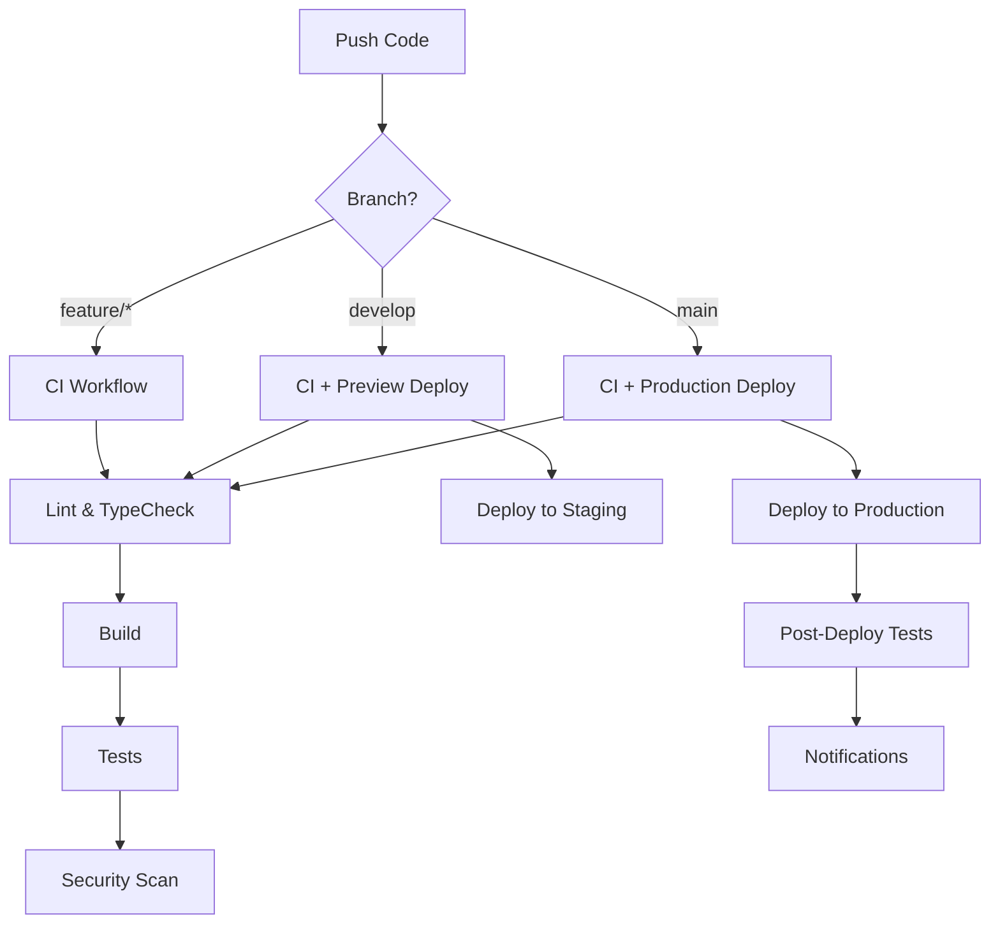

# 🚀 CI/CD Pipeline Setup Guide

Complete guide for setting up and using the CI/CD pipeline for WildScape Europe.

## 📋 Table of Contents

- [Overview](#overview)
- [Prerequisites](#prerequisites)
- [GitHub Secrets Configuration](#github-secrets-configuration)
- [Workflow Overview](#workflow-overview)
- [Deployment Platforms](#deployment-platforms)
- [Usage Guide](#usage-guide)
- [Troubleshooting](#troubleshooting)
- [Best Practices](#best-practices)

---

## 🎯 Overview

The WildScape Europe CI/CD pipeline provides:

- ✅ **Continuous Integration (CI)**
  - Automated builds on every push
  - Linting and code quality checks
  - TypeScript type checking
  - Bundle size analysis
  - Security scanning
  - Performance testing

- 🚀 **Continuous Deployment (CD)**
  - Automatic deployment to production
  - Preview deployments for PRs
  - Multiple platform support (Vercel, Netlify, AWS, GitHub Pages)
  - Post-deployment verification

- 🔒 **Security**
  - Dependency vulnerability scanning
  - Secret detection
  - License compliance checks
  - OWASP security analysis
  - CodeQL analysis

- 📦 **Release Automation**
  - Semantic versioning
  - Automated changelogs
  - Release asset generation
  - Multi-platform publishing

---

## 🔑 Prerequisites

Before setting up the CI/CD pipeline, ensure you have:

1. **GitHub Repository**
   - Admin access to the repository
   - GitHub Actions enabled

2. **Node.js Environment**
   - Node.js 18 or higher
   - npm or yarn package manager

3. **Deployment Platform Account** (choose one or more)
   - [Vercel](https://vercel.com) (Recommended)
   - [Netlify](https://netlify.com)
   - [AWS](https://aws.amazon.com) (S3 + CloudFront)
   - GitHub Pages

4. **Optional Services**
   - [Snyk](https://snyk.io) for security scanning
   - [Percy](https://percy.io) for visual regression testing
   - Slack workspace for notifications

---

## 🔐 GitHub Secrets Configuration

### Required Secrets

Navigate to **Settings → Secrets and variables → Actions** and add:

#### 1. Vercel Deployment (Recommended)

```bash
VERCEL_TOKEN=your_vercel_token
VERCEL_ORG_ID=your_organization_id
VERCEL_PROJECT_ID=your_project_id
```

**How to get these:**
1. Go to [Vercel Dashboard](https://vercel.com/dashboard)
2. Create a new project or use existing
3. Go to Settings → General → Project ID
4. Create token at: Account Settings → Tokens

#### 2. Mapbox (Optional but Recommended)

```bash
VITE_MAPBOX_TOKEN=your_mapbox_public_token
```

**How to get:**
1. Sign up at [Mapbox](https://account.mapbox.com/)
2. Go to Access Tokens
3. Create or use default public token

#### 3. Security Scanning (Optional)

```bash
SNYK_TOKEN=your_snyk_token
```

**How to get:**
1. Sign up at [Snyk](https://snyk.io)
2. Go to Account Settings → API Token
3. Copy the token

#### 4. Analytics (Optional)

```bash
VITE_GA_TRACKING_ID=your_google_analytics_id
```

#### 5. Notifications (Optional)

```bash
SLACK_WEBHOOK_URL=your_slack_webhook_url
```

**How to get:**
1. Go to Slack App settings
2. Create incoming webhook
3. Copy webhook URL

### Alternative Deployment Platforms

#### Netlify

```bash
NETLIFY_AUTH_TOKEN=your_netlify_token
NETLIFY_SITE_ID=your_site_id
```

#### AWS (S3 + CloudFront)

```bash
AWS_ACCESS_KEY_ID=your_aws_access_key
AWS_SECRET_ACCESS_KEY=your_aws_secret_key
AWS_REGION=us-east-1
S3_BUCKET_NAME=your_bucket_name
CLOUDFRONT_DISTRIBUTION_ID=your_distribution_id
CLOUDFRONT_URL=https://your-cloudfront-domain.com
```

#### Docker Hub (Optional)

```bash
DOCKERHUB_USERNAME=your_username
DOCKERHUB_TOKEN=your_token
```

#### NPM Publishing (Optional)

```bash
NPM_TOKEN=your_npm_token
```

---

## 📊 Workflow Overview

### 1. CI Workflow (`ci.yml`)

**Triggers:**
- Push to `main` or `develop` branches
- Pull requests to `main` or `develop`
- Manual workflow dispatch

**Jobs:**
1. **Setup** - Install and cache dependencies
2. **Lint** - ESLint and Prettier checks
3. **TypeCheck** - TypeScript type checking
4. **Build** - Build application (Node 18 & 20)
5. **Bundle Analysis** - Analyze bundle size
6. **Security Audit** - NPM audit and Snyk scan
7. **Lighthouse** - Performance testing
8. **Test** - Run tests (when configured)
9. **CI Success** - Summary report

**Approximate Duration:** 5-8 minutes

### 2. CD Workflow (`cd.yml`)

**Triggers:**
- Push to `main` branch
- Git tags starting with `v*`
- Manual workflow dispatch

**Jobs:**
1. **Build Production** - Create optimized build
2. **Deploy Vercel** - Deploy to Vercel production
3. **Deploy Netlify** - Alternative deployment (optional)
4. **Deploy AWS** - S3 + CloudFront (optional)
5. **Deploy GitHub Pages** - Free hosting option
6. **Post-Deploy Tests** - Smoke tests and verification
7. **Rollback** - Rollback on failure
8. **Deployment Summary** - Report generation

**Approximate Duration:** 3-5 minutes

### 3. PR Check Workflow (`pr-check.yml`)

**Triggers:**
- Pull request opened, synchronized, or reopened

**Jobs:**
1. **PR Validation** - Title validation and auto-labeling
2. **Code Quality** - ESLint with auto-fix
3. **Dependency Review** - Security and license checks
4. **Build Preview** - Deploy PR preview to Vercel
5. **Visual Regression** - Percy visual testing
6. **Accessibility Check** - a11y compliance
7. **Performance Budget** - Bundle size limits
8. **PR Summary** - Comprehensive report

**Approximate Duration:** 6-10 minutes

### 4. Security Workflow (`security.yml`)

**Triggers:**
- Daily at 3 AM UTC (scheduled)
- Push to `main` or `develop`
- Pull requests
- Manual workflow dispatch

**Jobs:**
1. **Dependency Scan** - NPM audit
2. **Snyk Scan** - Comprehensive security analysis
3. **CodeQL Analysis** - JavaScript/TypeScript analysis
4. **Secret Scan** - TruffleHog and GitLeaks
5. **License Compliance** - Check for restricted licenses
6. **OWASP Check** - Dependency vulnerability check
7. **Container Security** - Docker image scanning (optional)
8. **Security Summary** - Report and alerting

**Approximate Duration:** 10-15 minutes

### 5. Release Workflow (`release.yml`)

**Triggers:**
- Push git tags (`v*.*.*`)
- Manual workflow dispatch

**Jobs:**
1. **Create Release** - Generate GitHub release
2. **Build Release Assets** - Create downloadable archives
3. **Version Bump** - Automated version management
4. **Generate Changelog** - Update CHANGELOG.md
5. **Publish NPM** - Publish to NPM registry (optional)
6. **Publish Docker** - Push Docker images (optional)
7. **Post-Release Notifications** - Slack and GitHub notifications
8. **Release Summary** - Comprehensive report

**Approximate Duration:** 8-12 minutes

---

## 🚀 Deployment Platforms

### Option 1: Vercel (Recommended)

**Pros:**
- ✅ Zero-config deployment
- ✅ Automatic HTTPS
- ✅ Global CDN
- ✅ Preview deployments
- ✅ Excellent performance

**Setup Steps:**

1. **Create Vercel Project**
   ```bash
   npm i -g vercel
   vercel login
   vercel link
   ```

2. **Get Project IDs**
   ```bash
   vercel project ls
   cat .vercel/project.json
   ```

3. **Add to GitHub Secrets**
   - `VERCEL_TOKEN`
   - `VERCEL_ORG_ID`
   - `VERCEL_PROJECT_ID`

4. **Deploy**
   - Push to `main` branch
   - Automatic deployment triggered

### Option 2: GitHub Pages (Free)

**Pros:**
- ✅ Free hosting
- ✅ No configuration needed
- ✅ Good for open source projects

**Setup Steps:**

1. **Enable GitHub Pages**
   - Go to Settings → Pages
   - Source: GitHub Actions

2. **Deploy**
   - Already configured in `cd.yml`
   - Push to `main` branch

3. **Access**
   - `https://<username>.github.io/<repo-name>/`

### Option 3: Netlify

**Setup Steps:**

1. **Create Netlify Site**
   - Link GitHub repository
   - Build command: `npm run build`
   - Publish directory: `dist`

2. **Get Credentials**
   - Account Settings → Applications → Personal Access Tokens
   - Site Settings → General → Site ID

3. **Add to GitHub Secrets**
   - `NETLIFY_AUTH_TOKEN`
   - `NETLIFY_SITE_ID`

4. **Enable Workflow**
   - Edit `.github/workflows/cd.yml`
   - Set `deploy-netlify` job `if: true`

### Option 4: AWS S3 + CloudFront

**Setup Steps:**

1. **Create S3 Bucket**
   ```bash
   aws s3 mb s3://wildscape-europe
   aws s3 website s3://wildscape-europe --index-document index.html
   ```

2. **Create CloudFront Distribution**
   - Origin: S3 bucket
   - Enable compression
   - Custom error page: 404 → /index.html

3. **Create IAM User**
   - Permissions: S3 full access, CloudFront invalidation

4. **Add to GitHub Secrets**
   - `AWS_ACCESS_KEY_ID`
   - `AWS_SECRET_ACCESS_KEY`
   - `AWS_REGION`
   - `S3_BUCKET_NAME`
   - `CLOUDFRONT_DISTRIBUTION_ID`

5. **Enable Workflow**
   - Edit `.github/workflows/cd.yml`
   - Set `deploy-aws` job `if: true`

---

## 📖 Usage Guide

### Running CI/CD Workflows

#### Automatic Triggers

**CI Workflow runs on:**
```bash
git push origin main
git push origin develop
# Or create a pull request
```

**CD Workflow runs on:**
```bash
git push origin main
# Or create a release tag
git tag v1.0.0
git push origin v1.0.0
```

#### Manual Triggers

1. Go to **Actions** tab in GitHub
2. Select workflow to run
3. Click **Run workflow**
4. Choose branch and options
5. Click **Run workflow** button

### Creating a Release

#### Method 1: Automated Version Bump

1. Go to **Actions** → **Release Automation**
2. Click **Run workflow**
3. Select release type:
   - `patch`: 1.0.0 → 1.0.1 (bug fixes)
   - `minor`: 1.0.0 → 1.1.0 (new features)
   - `major`: 1.0.0 → 2.0.0 (breaking changes)
   - `prerelease`: 1.0.0 → 1.0.1-alpha.0
4. Workflow will:
   - Bump version in package.json
   - Create git tag
   - Push changes
   - Create release

#### Method 2: Manual Release

```bash
# Bump version
npm version patch  # or minor, major, prerelease

# Push tag
git push origin main
git push origin --tags

# Release workflow will automatically run
```

### PR Preview Deployments

1. **Create Pull Request**
   ```bash
   git checkout -b feature/new-feature
   git push origin feature/new-feature
   # Create PR on GitHub
   ```

2. **Automatic Preview**
   - PR check workflow runs automatically
   - Preview deployment to Vercel
   - Comment on PR with preview URL

3. **Access Preview**
   - Click URL in PR comment
   - URL format: `pr-{number}.wildscape-europe.vercel.app`

### Monitoring Workflows

#### View Workflow Status

1. **Repository Badges** (add to README)
   ```markdown
   
   
   ```

2. **Actions Tab**
   - Real-time workflow execution
   - Detailed logs for each job
   - Artifact downloads

3. **Slack Notifications** (if configured)
   - Real-time alerts
   - Success/failure notifications
   - Deployment URLs

#### Workflow Artifacts

Download build artifacts:
1. Go to **Actions** → Select workflow run
2. Scroll to **Artifacts** section
3. Download:
   - `build-artifacts` - Production build
   - `pr-preview-{number}` - PR preview build
   - `bundle-analysis` - Bundle size report
   - `coverage-reports` - Test coverage
   - `lint-results` - Linting results

---

## 🔧 Troubleshooting

### Common Issues

#### 1. Build Failures

**Error: "Cannot find module"**
```bash
# Solution: Clear cache and reinstall
rm -rf node_modules package-lock.json
npm install
git add package-lock.json
git commit -m "fix: update dependencies"
git push
```

**Error: "Out of memory"**
```yaml
# Add to workflow job:
env:
  NODE_OPTIONS: --max-old-space-size=4096
```

#### 2. Deployment Failures

**Vercel: "Invalid token"**
- Regenerate token in Vercel dashboard
- Update `VERCEL_TOKEN` secret

**Vercel: "Project not found"**
- Run `vercel link` locally
- Copy IDs from `.vercel/project.json`
- Update secrets

#### 3. Security Scan Failures

**NPM Audit: High vulnerabilities**
```bash
# Review vulnerabilities
npm audit

# Fix automatically
npm audit fix

# Force fix (may break things)
npm audit fix --force

# Update specific package
npm update <package-name>
```

**Snyk: "Invalid token"**
- Get new token from Snyk dashboard
- Update `SNYK_TOKEN` secret

#### 4. TypeScript Errors

```bash
# Check locally first
npm run type-check

# Fix common issues
npm install --save-dev @types/<missing-types>

# Regenerate lock file
rm package-lock.json
npm install
```

#### 5. Workflow Not Triggering

- Check branch protection rules
- Verify workflow file syntax
- Check GitHub Actions permissions
- Review workflow trigger conditions

### Debug Mode

Enable workflow debugging:
1. Settings → Secrets → Actions
2. Add secret: `ACTIONS_STEP_DEBUG` = `true`
3. Rerun workflow for detailed logs

### Getting Help

1. **Check Logs**
   - Actions tab → Failed workflow → Click job → Expand step

2. **GitHub Discussions**
   - Post in project discussions

3. **Create Issue**
   - Use bug report template
   - Include workflow logs

---

## 🎯 Best Practices

### 1. Branch Strategy

```
main (production)
  ↑
develop (staging)
  ↑
feature/* (development)
```

**Workflow:**
1. Create feature branch from `develop`
2. PR to `develop` triggers preview deployment
3. PR to `main` triggers production deployment

### 2. Commit Messages

Follow conventional commits:
```bash
feat: add new campsite filter
fix: resolve map rendering issue
docs: update README
style: format code
refactor: reorganize components
perf: optimize bundle size
test: add unit tests
build: update dependencies
ci: improve workflow performance
chore: update tooling
```

### 3. Version Management

**Semantic Versioning (SemVer):**
- `MAJOR.MINOR.PATCH`
- `MAJOR`: Breaking changes
- `MINOR`: New features (backward compatible)
- `PATCH`: Bug fixes

**Pre-releases:**
- `1.0.0-alpha.1` - Alpha release
- `1.0.0-beta.1` - Beta release
- `1.0.0-rc.1` - Release candidate

### 4. Security

- **Never commit secrets** to repository
- Use environment variables for sensitive data
- Regular dependency updates
- Review security scan results
- Enable Dependabot alerts

### 5. Performance

- Monitor bundle sizes
- Set performance budgets
- Review Lighthouse scores
- Optimize images and assets
- Use code splitting

### 6. Code Quality

- Run linting locally before pushing
- Use pre-commit hooks
- Write meaningful commit messages
- Keep PRs focused and small
- Request code reviews

### 7. Testing

- Write tests for new features
- Maintain test coverage
- Run tests locally before pushing
- Test on multiple browsers/devices

---

## 📊 Workflow Status Matrix

| Workflow | Status | Frequency | Duration | Critical |
|----------|--------|-----------|----------|----------|
| CI | ✅ Active | Every push | ~6 min | Yes |
| CD | ✅ Active | Main branch | ~4 min | Yes |
| PR Check | ✅ Active | Every PR | ~8 min | Yes |
| Security | ✅ Active | Daily + Push | ~12 min | Yes |
| Release | ✅ Active | Tags only | ~10 min | No |

---

## 🔄 CI/CD Pipeline Flow



---

## 📞 Support

For CI/CD related issues:

1. **Documentation**: Read this guide thoroughly
2. **Workflow Logs**: Check detailed logs in Actions tab
3. **Issues**: Create issue with `ci/cd` label
4. **Discussions**: Ask in GitHub Discussions

---

## 📝 Changelog

- **2024-01-XX**: Initial CI/CD pipeline setup
- **2024-01-XX**: Added security scanning
- **2024-01-XX**: Implemented release automation

---

**Last Updated**: January 2024  
**Version**: 1.0.0  
**Maintainer**: @Alexi5000

