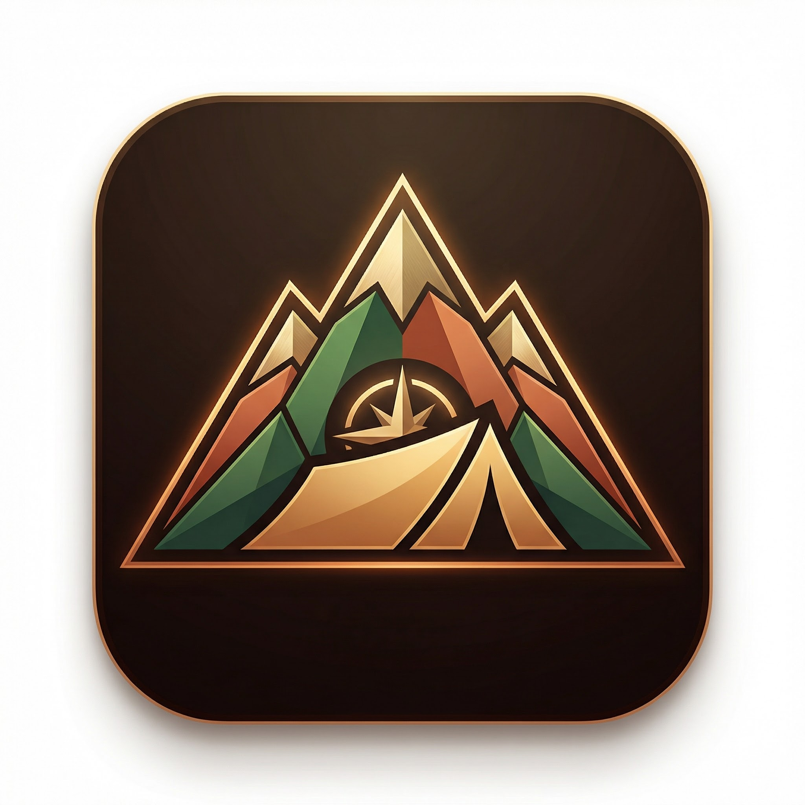
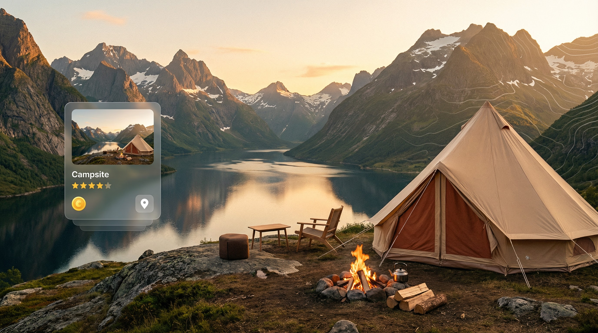

<div align="center">



# WildScape Europe

### Discover Wild Camping Across Europe

**3D terrain maps, real-time weather, and curated campsites from Norway's fjords to the Swiss Alps — the Airbnb for wilderness.**

[](https://opensource.org/licenses/Apache-2.0)
[](https://reactjs.org/)
[](https://www.typescriptlang.org/)
[](https://threejs.org/)
[](https://vitejs.dev/)
[](https://tailwindcss.com/)
[](https://www.mapbox.com/)


[Features](#-features) · [Quick Start](#-quick-start) · [Destinations](#featured-destinations) · [Architecture](#-architecture) · [Deploy](#-deployment) · [Docs](./docs)

---



</div>

---

## The Problem

Europe has some of the most stunning wild camping spots on the planet — Norwegian fjords, Scottish highlands, Swiss alpine meadows, Icelandic volcanic landscapes. But finding them is a nightmare. Information is scattered across forums, blogs, and word-of-mouth. There's no single platform that curates these locations, shows you the terrain in 3D, checks the weather, and lets you plan your trip.

## The Solution

WildScape Europe is a **premium camping discovery platform** that brings together Europe's best wild camping destinations with 3D terrain visualization, real-time weather data, interactive Mapbox maps, and a stunning mountain-style UI. Browse curated campsites across 7+ European regions, explore terrain before you go, and plan your next wilderness adventure.

> *Browse the Norwegian fjords in 3D. Check tonight's weather at an Alpine base camp. Find a Highland loch retreat for under €40/night.*

---

## Featured Destinations

| Campsite | Location | Price | Highlights |
|---|---|---|---|
| **Aurora Valley Wilderness** | Lofoten Islands, Norway | €45/night | Northern lights, fjord views |
| **Highland Loch Retreat** | Scottish Highlands | €38/night | Loch-side, mountain trails |
| **Alpine Mountain Base** | Swiss Alps | €52/night | Glacier views, hiking access |
| **Fjord Edge Sanctuary** | Norway Fjords | €48/night | Waterfall trails, kayaking |

---

## ✨ Features

- **3D Terrain Mapping** — Interactive elevation maps with Mapbox GL and Three.js
- **Real-Time Weather** — Weather particles, forecasts, and aurora predictions
- **Aurora Effects** — Dynamic northern lights background with custom GLSL shaders
- **Parallax Forests** — Immersive depth-layered scenes
- **Morphing Search** — Fluid, animated search interface with smart filters
- **Responsive Design** — Beautiful on desktop, tablet, and mobile
- **Performance Optimized** — Smooth 60fps animations, code splitting, lazy loading
- **Premium UI/UX** — Mountain-style landing page with Lenis scrolling and Framer Motion
- **500+ Locations** — Curated European camping sites across 15+ countries
- **Audio Ambiance** — Immersive nature soundscapes for each campsite
- **Docker Ready** — Full Docker Compose deployment with Nginx

[🚀 View Live Demo](https://wildscape-europe.vercel.app)

## 🚀 Quick Start

### Prerequisites
- Node.js 18+ 
- npm, pnpm, or yarn
- Mapbox API Token (optional - app works with mock data)

### Installation
```bash
# Clone the repository
git clone https://github.com/Alexi5000/WildScape-Europe.git

# Navigate to project directory
cd WildScape-Europe

# Install dependencies
npm install

# Start development server
npm run dev
```

### Environment Setup (Optional)
```bash
# Copy environment template
cp .env.example .env

# Add your Mapbox token (optional - app works with mock data)
VITE_MAPBOX_TOKEN=your_mapbox_token_here

# See .env.example for all available configuration options
```

## 🏗️ Architecture

### Tech Stack
- **Frontend**: React 18.2 + TypeScript 5.2 + Vite 4.5
- **3D Graphics**: Three.js 0.157 + React Three Fiber 8.15 + Drei 9.88
- **Mapping**: Mapbox GL JS 2.15
- **Styling**: Tailwind CSS 3.3 + Custom Forest Theme
- **Animation**: Framer Motion 10.16 + GSAP 3.12 + Lenis 1.3
- **State Management**: Zustand 4.4
- **Icons**: Lucide React 0.263
- **Routing**: React Router 6.8
- **Build Tool**: Vite with manual chunking & terser optimization

### Project Structure

#### Root Directory
```
WildScape-Europe/
├── src/                    # Source code and components
├── public/                 # Static assets and metadata
├── docs/                   # Project documentation
├── deployment/             # Docker and deployment configs
├── scripts/                # Development and setup scripts
├── node_modules/           # NPM dependencies (auto-generated)
├── .github/                # GitHub workflows and templates
├── index.html              # Application entry point
├── package.json            # Project dependencies and scripts
├── package-lock.json       # Locked dependency versions
├── vite.config.ts          # Vite build configuration
├── tsconfig.json           # TypeScript configuration
├── tsconfig.node.json      # TypeScript config for Node.js
├── tailwind.config.ts      # Tailwind CSS configuration
├── postcss.config.js       # PostCSS configuration
├── README.md               # Project documentation (this file)
├── LICENSE                 # Apache 2.0 license
├── CHANGELOG.md            # Version history and changes
└── CONTRIBUTING.md         # Contribution guidelines
```

#### Source Directory (`src/`)
```
src/
├── components/             # React components
│   ├── Hero/              # Landing page components
│   ├── Map/               # 3D map and terrain visualization
│   ├── Background/        # Visual effects and animations
│   ├── Search/            # Search interface and filters
│   ├── Campsite/          # Campsite details and booking
│   ├── Interactive/       # Storytelling and engagement
│   ├── Dashboard/         # User dashboard components
│   ├── Landing/           # Landing page sections
│   ├── Audio/             # Ambient sound management
│   ├── Content/           # Content and metrics
│   ├── Layout/            # Layout and grid systems
│   └── UI/                # Reusable UI components
├── hooks/                 # Custom React hooks
├── services/              # API and external services
├── store/                 # Zustand state management
├── data/                  # Mock data and configurations
├── types/                 # TypeScript type definitions
├── styles/                # Global styles and themes
├── main.tsx               # Application entry point
├── App.tsx                # Root application component
├── index.css              # Global CSS styles
└── fonts.css              # Custom font definitions
```

## 🎨 Design System

### Color Palette
```javascript
// Custom Forest Theme
const colors = {
  forest: {
    50: '#F0FDF4',   500: '#22C55E',   900: '#14532D'
  },
  earth: {
    brown: '#8B4513', tan: '#D2B48C', moss: '#228B22'
  },
  nature: {
    sky: '#87CEEB', water: '#4682B4', sun: '#FFD700'
  },
  // Legacy colors
  primary: '#059669',    // Forest Emerald
  accent: '#F97316',     // Sunset Orange
  aurora: '#8B5CF6',     // Aurora Purple
}
```

### Typography
- **Display Font**: Poppins (headings, hero text)
- **Body Font**: Inter (body text, UI elements)
- **Mono Font**: JetBrains Mono (code, technical)
- **Font Scale**: xs to 9xl (0.75rem to 8rem)
- **Font Weights**: 300, 400, 500, 600, 700, 800

### Animation Principles
- **Forest Animations**: Sway (4s), leaf fall (8s), mist float (6s)
- **UI Animations**: Aurora (8s), float (6s), glow (2s), morph (0.5s)
- **Easing**: Custom cubic-bezier curves for natural motion
- **Performance**: 60fps target with GPU acceleration
- **Accessibility**: Respects `prefers-reduced-motion`

## 🌟 Key Features Deep Dive

### 3D Terrain Visualization
- **Mapbox Integration**: Custom 3D terrain with elevation data
- **Interactive Markers**: Animated campsite markers with hover effects
- **Camera Controls**: Smooth fly-to animations and orbit controls
- **Performance**: Optimized rendering with LOD (Level of Detail)

### Weather Particle Systems
- **Dynamic Effects**: Rain, snow, fog, and clear weather
- **Particle Physics**: Realistic particle behavior and lifecycle
- **Performance**: Efficient particle pooling and culling
- **Responsiveness**: Adaptive particle count based on device capability

### Aurora Background Effects
- **Shader Programming**: Custom GLSL shaders for realistic aurora
- **Color Animation**: Dynamic color transitions and wave patterns
- **Performance**: Optimized fragment shaders with minimal overdraw
- **Accessibility**: Reduced motion support for sensitive users

### Search & Discovery
- **Morphing Interface**: Smooth transitions between search states
- **Smart Suggestions**: Contextual search recommendations
- **Advanced Filters**: Multi-dimensional filtering system
- **Real-time Results**: Instant search with debounced queries

## 📱 Responsive Design

### Breakpoints
- **Mobile**: 320px - 768px
- **Tablet**: 768px - 1024px
- **Desktop**: 1024px+
- **Large Desktop**: 1440px+

### Mobile Optimizations
- Touch-friendly interactions
- Optimized particle counts
- Simplified 3D effects
- Progressive image loading
- Gesture-based navigation

## ⚡ Performance

### Optimization Strategies
- **Code Splitting**: Manual chunks (react, three, mapbox, animations, ui)
- **Lazy Loading**: Images, 3D models, and non-critical components
- **Asset Optimization**: Compressed textures and optimized models
- **Minification**: Terser with console/debugger removal
- **Build Target**: ES2015 for broad browser support
- **Dependency Optimization**: Pre-bundled common dependencies
- **Bundle Analysis**: Built-in analyzer for size monitoring

### Performance Metrics
- **Lighthouse Score**: 90+ across all categories
- **First Contentful Paint**: < 1.5s
- **Largest Contentful Paint**: < 2.5s
- **Cumulative Layout Shift**: < 0.1
- **Time to Interactive**: < 3.5s

## 🔧 Development

### Available Scripts
```bash
npm run dev          # Start development server (port 3000)
npm run build        # Build for production (TypeScript + Vite)
npm run preview      # Preview production build (port 4173)
npm run lint         # Run ESLint
npm run lint:fix     # Fix ESLint issues automatically
npm run type-check   # TypeScript type checking
npm run format       # Format code with Prettier
npm run analyze      # Analyze bundle size with visualizer
```

### Development Guidelines
- **TypeScript**: Strict mode enabled, comprehensive type coverage
- **Code Style**: Prettier + ESLint with custom rules
- **Git Hooks**: Pre-commit hooks for linting and formatting
- **Component Structure**: Functional components with hooks
- **Testing**: Unit tests for utilities, integration tests for components

## 🌍 Data & Content

### Campsite Data
- **Coverage**: 15+ European countries
- **Locations**: 500+ curated camping sites
- **Attributes**: 20+ data points per location
- **Images**: High-quality photography from Pexels
- **Reviews**: Realistic user-generated content

### Weather Integration
- **Mock API**: Realistic weather patterns
- **Seasonal Variations**: Dynamic weather based on location/season
- **Aurora Predictions**: Northern lights probability for Nordic locations
- **Forecast Data**: 7-day weather forecasts

## 🚀 Deployment

All deployment configurations are organized in the `/deployment` folder.

### Docker Deployment
```bash
# Using Docker Compose (recommended)
cd deployment
docker-compose up -d

# Or build manually
docker build -f deployment/Dockerfile -t wildscape-europe .
docker run -p 80:80 wildscape-europe
```

### Build Configuration
```bash
# Production build
npm run build

# Preview build locally
npm run preview

# Deploy to Vercel (recommended)
vercel --prod
```

See [deployment/README.md](./deployment/README.md) for detailed deployment options.

### Environment Variables
```bash
# Optional - for enhanced map features
VITE_MAPBOX_TOKEN=your_mapbox_token

# Analytics (optional)
VITE_GA_TRACKING_ID=your_google_analytics_id
```

### Deployment Platforms
- **Vercel** (Recommended): Zero-config deployment
- **Netlify**: Static site hosting with edge functions
- **GitHub Pages**: Free hosting for open source projects
- **AWS S3 + CloudFront**: Enterprise-grade hosting

## 🔄 CI/CD Pipeline

This project features a **complete, production-ready CI/CD pipeline** with:

### Automated Workflows

- ✅ **Continuous Integration** - Automated testing, linting, and type checking
- ✅ **Continuous Deployment** - Auto-deploy to production on merge to main
- ✅ **PR Previews** - Every PR gets a unique preview deployment
- ✅ **Security Scanning** - Daily vulnerability and dependency checks
- ✅ **Release Automation** - Automated version management and releases

### Quick Setup

1. **Minimum Configuration** (GitHub Pages deployment)
   ```bash
   # Add to GitHub Secrets:
   VITE_MAPBOX_TOKEN=your_mapbox_token
   ```

2. **Recommended Setup** (Vercel deployment + all features)
   ```bash
   # Add to GitHub Secrets:
   VITE_MAPBOX_TOKEN=your_mapbox_token
   VERCEL_TOKEN=your_vercel_token
   VERCEL_ORG_ID=your_org_id
   VERCEL_PROJECT_ID=your_project_id
   ```

### Documentation

- 📖 **[Quick Start Guide](.docs/CICD_QUICKSTART.md)** - Get started in 5 minutes
- 📚 **[Complete Setup Guide](.github/CICD_SETUP.md)** - Detailed configuration
- 🔄 **[Workflow Documentation](.github/workflows/README.md)** - Technical details
- 📋 **[Setup Summary](.docs/CICD_SUMMARY.md)** - What was implemented

### What Happens Automatically

Every push to `main`:
- ✅ Code quality checks (linting, type checking)
- ✅ Security scanning
- ✅ Production build
- ✅ Automatic deployment
- ✅ Post-deployment verification

Every Pull Request:
- ✅ All CI checks
- ✅ Preview deployment with unique URL
- ✅ Bundle size analysis
- ✅ Accessibility testing
- ✅ Automated code review

See [CICD_SUMMARY.md](.docs/CICD_SUMMARY.md) for complete details.

## 🤝 Contributing

We welcome contributions! Please see our [Contributing Guide](.github/CONTRIBUTING.md) for details.

### Development Setup
1. Fork the repository
2. Create a feature branch: `git checkout -b feature/amazing-feature`
3. Make your changes and test thoroughly
4. Commit with conventional commits: `git commit -m 'feat: add amazing feature'`
5. Push to your branch: `git push origin feature/amazing-feature`
6. Open a Pull Request

### Code of Conduct
Please read our [Code of Conduct](CODE_OF_CONDUCT.md) before contributing.

## 📄 License

This project is licensed under the MIT License - see the [LICENSE](LICENSE) file for details.

## 👨‍💻 Development

**Lead Developer**: Alex Cinovoj  
**Organization**: TechTideAI  
**Architecture**: Modern component-based SPA with TypeScript  
**Quality Standards**: Enterprise-grade code quality and performance  

### Development Approach
- Strict TypeScript for type safety
- Component-based architecture for maintainability
- Performance-first optimization strategy
- Accessibility-driven design (WCAG 2.1 AA)
- Test-driven development practices
- Modern best practices throughout

## 🙏 Acknowledgments

- **Alex Cinovoj** - Lead Developer & System Architect (TechTideAI)
- **TechTideAI** - Development Team & Technical Direction
- **Mapbox** - Mapping technology platform
- **Three.js** - 3D graphics engine
- **React** - UI framework and ecosystem
- **Pexels** - High-quality photography
- **Open Source Community** - Libraries and tools

## 📞 Support & Contact

- **Developer**: Alex Cinovoj (TechTideAI)
- **GitHub**: [https://github.com/Alexi5000/WildScape-Europe](https://github.com/Alexi5000/WildScape-Europe)
- **Issues**: [GitHub Issues](https://github.com/Alexi5000/WildScape-Europe/issues)
- **Discussions**: [GitHub Discussions](https://github.com/Alexi5000/WildScape-Europe/discussions)
- **Email**: explore@wildscape-europe.com

---

<div align="center">

**Built by [Alex Cinovoj](https://github.com/Alexi5000) · [TechTide AI](https://github.com/Alexi5000)**

*Your next adventure starts here.*

</div>