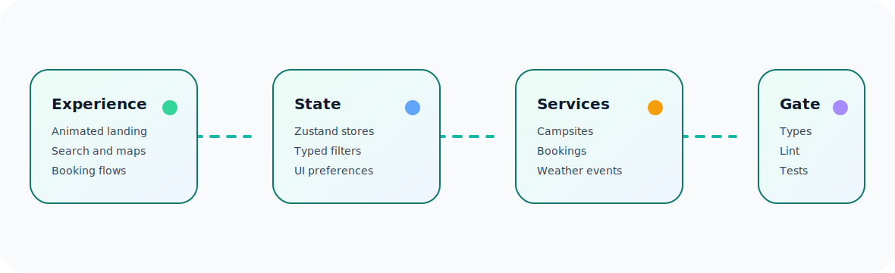

# WildScape Europe Documentation

  

The WildScape Europe documentation set is intentionally focused. Each document owns a clear part of the Release 1.0.0 repository and supports the CloseLight Repo Hygiene standard.

| Document | Purpose |
|---|---|
| [`RELEASE_1_0.md`](RELEASE_1_0.md) | Release 1.0.0 note, shipped capabilities, validation evidence, and launch checklist. |
| [`SESSION_AND_DATA.md`](SESSION_AND_DATA.md) | Session behavior, data contracts, and schema-readiness policy for the working app. |
| [`ARCHITECTURE.md`](ARCHITECTURE.md) | SOLID service boundaries, dependency flow, state ownership, and module responsibilities. |
| [`API.md`](API.md) | Typed application service contracts, response shapes, and domain behavior. |
| [`TESTING.md`](TESTING.md) | Automated test strategy, test coverage map, fixtures, and validation commands. |
| [`QUALITY.md`](QUALITY.md) | State-of-the-art repo quality standard and acceptance gates. |
| [`REPO_HYGIENE.md`](REPO_HYGIENE.md) | CloseLight maintenance rules for docs, scripts, branches, and release readiness. |
| [`MAINTAINER_GUIDE.md`](MAINTAINER_GUIDE.md) | Maintainer workflow, review checklist, and release process. |
| [`DEPLOYMENT.md`](DEPLOYMENT.md) | Production build, static hosting, environment variables, and deployment checklist. |
| [`GETTING_STARTED.md`](GETTING_STARTED.md) | Local setup, first-run workflow, troubleshooting, and contribution path. |

## Recommended reading order

New maintainers should begin with the README, then read the release note, architecture guide, testing guide, and hygiene guide. Deployment and API documentation should be read when preparing production builds or changing service contracts.
