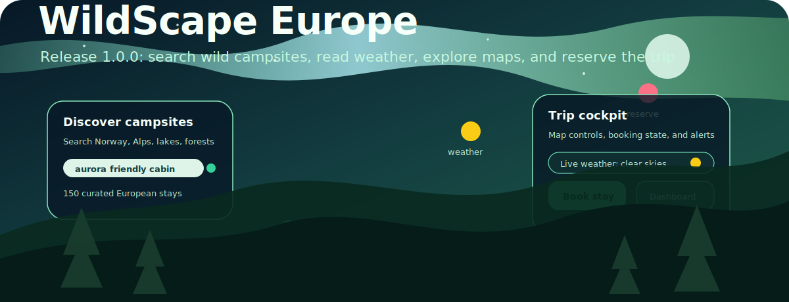

# WildScape Europe Release 1.0

<p align="center">
  
</p>

**Release 1.0** is the stable production-quality milestone for WildScape Europe. It packages the immersive camping discovery experience with strict typing, SOLID service decomposition, automated tests, animated README assets, and CloseLight Repo Hygiene.

> CloseLight Repo Hygiene means closing loose ends, keeping the repository surface light, and proving the final state with a repeatable validation gate.

## Release summary

| Area | Release state |
|---|---|
| Version | `1.0.0` |
| Branch | `main` |
| App type | React 18, TypeScript, Vite, Tailwind CSS, Zustand, Mapbox GL, Three.js, Framer Motion, GSAP, and Lenis.[1] [2] |
| Quality gate | `npm run hygiene` |
| Test suite | Vitest and Testing Library service, store, and adapter tests.[3] [4] |
| Documentation | README, release note, architecture, API, testing, quality, hygiene, deployment, and onboarding guides. |

## What shipped

Release 1.0 includes the complete campsite discovery loop. The application supports typed campsite search, filter translation, user bookings, seeded profile behavior, weather and aurora data, real-time events, map controls, and immersive animated interface layers. The service layer is split by responsibility so each module owns one domain concern and the top-level facades remain stable for UI consumers.

| Capability | Release detail |
|---|---|
| Animated graphics | README and release pages include animated SVG hero and system-flow graphics stored in `docs/assets`. |
| SOLID architecture | Campsite, booking, user, weather, enhanced API, real-time, map, store, and UI responsibilities are isolated. |
| Strict contracts | Shared types describe domain entities, API responses, app handlers, weather values, map values, and event payloads. |
| Validation | TypeScript, ESLint, Vitest, production build, and Markdown hygiene are executable from package scripts. |
| Repo hygiene | Stale documentation has been replaced by a small curated document set with a clear owner path for future changes. |

## Validation evidence

The Release 1.0 validation gate is designed to be run locally before every push and before every tagged release.

```bash
npm run hygiene
```

| Gate | Expected result |
|---|---|
| `npm run docs:check` | Authored Markdown passes the no em dash rule and required release docs exist. |
| `npm run type-check` | TypeScript completes without emitting files. |
| `npm run lint` | ESLint completes with zero warnings. |
| `npm run test` | Vitest completes with all tests passing. |
| `npm run build` | Vite writes production assets into `dist/`. |

## Launch checklist

| Check | Owner expectation |
|---|---|
| Product | Run the app locally and verify search, filters, map controls, dashboard, and booking simulation. |
| Engineering | Run `npm run hygiene` from a clean checkout. |
| Documentation | Confirm README, release note, testing, quality, and hygiene documents match the current scripts. |
| Deployment | Build from `main` and deploy `dist/` to the static host. |
| Release | Tag the commit as `v1.0.0` only after the validation gate passes. |

## References

[1]: https://react.dev/ "React Documentation"
[2]: https://vite.dev/ "Vite Documentation"
[3]: https://vitest.dev/ "Vitest Documentation"
[4]: https://testing-library.com/docs/react-testing-library/intro/ "React Testing Library Introduction"
